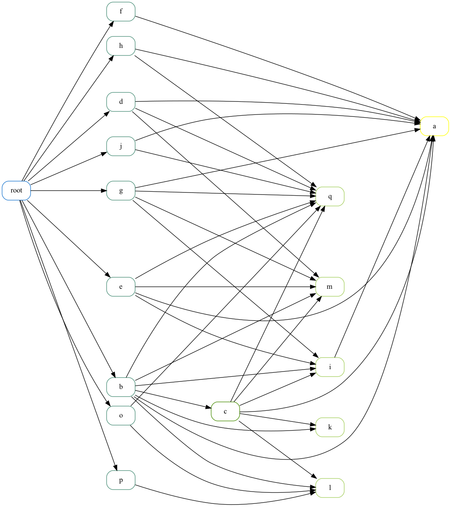

# Dependency tree generation tool

This small `ammonite` script uses [Coursier](get-coursier.io) to get the dependencies of some Maven repositories and helps you visualize the resulting tree.

### Getting started
```
$ amm deptree.sc > deptree.dot
$ dot -Tpng deptree.dot -o deptree.png
```

